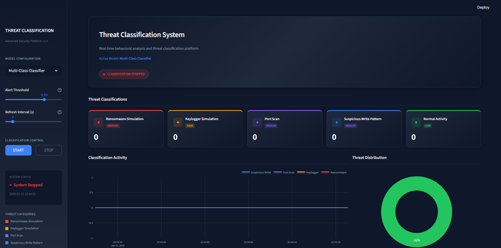
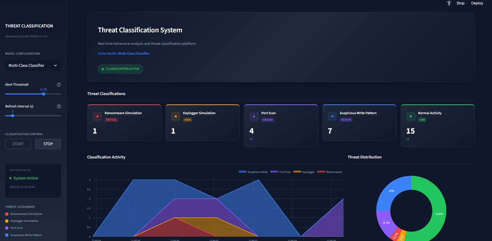
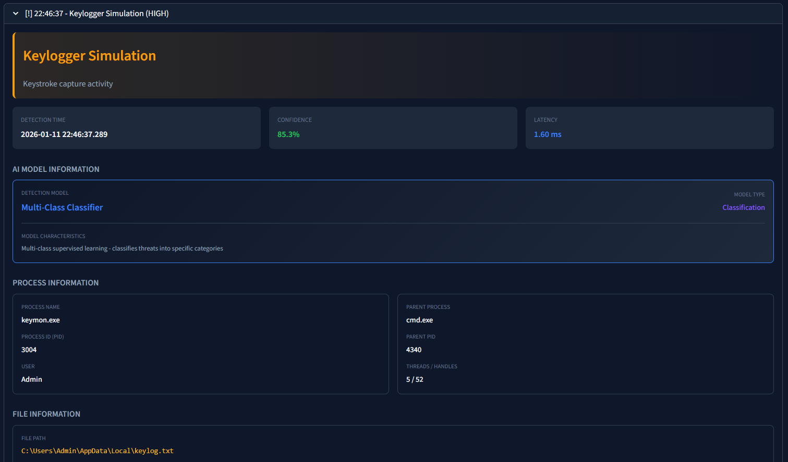
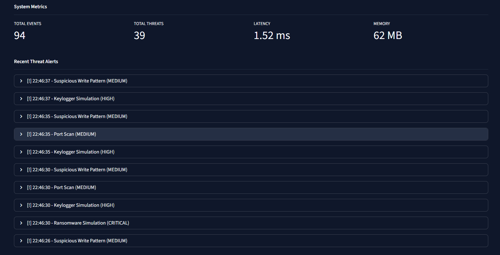

# Système de Détection Comportementale

[](https://www.python.org)
[](https://www.docker.com)
[](LICENSE)

> Avertissement : Ce projet est à des fins éducatives uniquement. L'exécution ou le téléchargement de logiciels malveillants réels est strictement interdit. Testez uniquement dans des environnements isolés ou lab autorisés.

---

## Sommaire

- [Description](#description)  
- [Fonctionnalités](#fonctionnalit%C3%A9s)  
- [Captures d'écran](#captures-d%C3%A9cran)  
- [Prérequis](#pr%C3%A9requis)  
- [Installation rapide](#installation-rapide)  
- [Utilisation (commandes run.py)](#utilisation-commandes-runpy)  
- [Déploiement (Docker)](#d%C3%A9ploiement-docker)  
- [Configuration & fichiers importants](#configuration--fichiers-importants)  
- [Dépannage](#d%C3%A9pannage)  
- [Licence](#licence)  

---

## Description

Le Système de Détection Comportementale surveille les activités système (processus, réseau, fichiers), collecte des caractéristiques comportementales et utilise des modèles ML pour détecter les anomalies (ransomware, keyloggers, scans, etc.). Une interface Web (Streamlit) permet l'analyse et le suivi en temps réel.

Ce dépôt fournit :
- collecteurs et simulateurs (génération de données),
- pipeline d'entraînement et d'évaluation,
- moteur de détection temps réel,
- interface utilisateur pour visualisation,
- scripts utilitaires et tests.

---

## Fonctionnalités

- Surveillance en temps réel des processus, réseau et système de fichiers  
- Génération d'ensembles de données et pipelines d'ingénierie des features  
- Entraînement et évaluation de modèles de classification comportementale  
- Dashboard Streamlit pour visualiser détections et détails d'événements  
- Outils CLI pour automatisation et tests  
- Option de déploiement conteneurisé (Docker)

---

## Captures d'écran

Intégration des images présentes dans le dépôt — elles seront affichées dans GitHub et lors du partage.

### Écran d'accueil / Vue générale


### Détection — Vue résultats


### Détails d'un événement (exemples)


### Détails : Malwares détectés


---

## Prérequis

- Python 3.9+  
- (Optionnel) Docker & docker-compose pour conteneurisation  
- Environnement isolé pour tests (VM, lab) — NE PAS exécuter sur systèmes de production  
- Recommandé : créer un environnement virtuel Python

---

## Installation rapide

1. Cloner le dépôt
```bash
git clone https://github.com/b1l4l-sec/behavioral_detection.git
cd behavioral_detection
```

2. Créer et activer un environnement virtuel
```bash
python3 -m venv .venv
source .venv/bin/activate
```

3. Installer dépendances
```bash
pip install -r requirements.txt
```

4. Consulter la documentation détaillée d'installation et configuration :
- `SETUP.md` pour étapes d'installation détaillées
- `config/` pour variables et modèles de configuration

---

## Utilisation (commandes run.py)

Le script `run.py` orchestre les composants principaux :

- Lancer le dashboard Streamlit :
```bash
python run.py dashboard
# ou (direct streamlit)
streamlit run src/interface/streamlit_app.py
```

- Démarrer le détecteur temps réel :
```bash
python run.py detector
```

- Lancer le collecteur de données :
```bash
python run.py collector
```

- Générer des données (dataset pour entraîner) :
```bash
python run.py generator
```

- Entraîner les modèles :
```bash
python run.py trainer
```

- Lancer tous les composants (développement/test local) :
```bash
python run.py all
```

- Exécuter la suite de tests :
```bash
python run.py tests
```

---

## Déploiement (Docker)

Un Dockerfile est fourni pour construire une image applicative minimale. Un `docker-compose.yml` simplifié est présent pour des tests rapides :

```bash
# Construire l'image (depuis la racine du repo)
docker build -t behavioral-detection .

# Lancer via docker-compose (exemple)
docker-compose up -d
```

Voir `SETUP.md` pour la procédure complète de production et recommandations (volumes, ports, variables d'environnement).

---

## Configuration & fichiers importants

- `config/config.example.yaml` — modèle de configuration  
- `run.py` — point d'entrée pour orchestrer les composants  
- `src/collector/` — collecte des données (process, network, fs)  
- `src/detector/` — moteur de détection temps réel  
- `src/models/` — gestion des modèles ML  
- `src/interface/` — interface Streamlit  
- `SETUP.md` — guide d'installation approfondi  

Avant d'exécuter, copiez le fichier de configuration exemple :
```bash
cp config/config.example.yaml config/config.yaml
# puis éditez config/config.yaml si nécessaire
```

Exécuter:
```bash
.\.venv\Scripts\streamlit.exe run src\interface\streamlit_app.py
```

---

## Dépannage (rapide)

- Erreurs liées à Streamlit : vérifier version de `streamlit` et que `.venv` est activé  
- Problèmes de dépendances : relancer `pip install -r requirements.txt` dans l'environnement virtuel  
- Problèmes de port occupé : identifier process avec `lsof -i :PORT` et le terminer si sécurisé  
- Logs : consulter le répertoire `logs/` (si configuré) ou sortie STDOUT du service

Pour plus de détails voir `SETUP.md` et les fichiers de logs produits lors des exécutions.

---

## Tests & validation

- Les commandes `python run.py tests` exécutent les tests unitaires et d'intégration fournis.  
- Un générateur de scénarios permet de simuler comportements bénins et malveillants pour valider les modèles.

---

## Contribution

Contributions bienvenues — forkez le dépôt, apportez vos changements sur une branche dédiée et soumettez une Pull Request. Merci d'ajouter des tests et de documenter les nouveautés.

---

## Licence

Projet fourni à titre éducatif. Vérifiez le fichier `LICENSE` pour les détails (MIT).

---

Si vous voulez que j'engage directement ce README modifié dans le dépôt (création d'une branche + commit + PR), je peux le faire pour vous — dites-moi si vous souhaitez que je procède.
